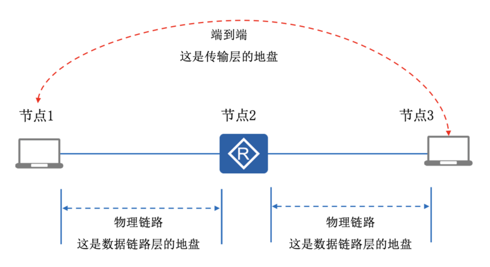

## 网络工程师

# 一、计算机网络概论🌟🌟

计算机网络分类

- 通信子网：通信节点（集线器、交换机、路由器等）和通信链路（电话线、同轴电缆、无线电路、卫星线路、光缆等）。
- 用户资源网：PC、服务器等

按照覆盖范围可以把网络分为 `个人网（PAN）、局域网（LAN）、城域网（MAN）、广域网（WAN）`
### OSI和TCP/IP的参考模型

- OSI参考模型

  | 层级 | 名称       | 主要功能                               | 典型协议/设备        |
  | ---- | ---------- | -------------------------------------- | -------------------- |
  | 7    | 应用层     | 为应用程序提供网络服务                 | HTTP、FTP、SMTP、DNS |
  | 6    | 表示层     | 数据格式转换、加密解密、压缩解压缩     | JPEG、MPEG、ASCII    |
  | 5    | 会话层     | 建立、管理和终止会话                   | NetBIOS、RPC         |
  | 4    | 传输层     | 端到端连接、可靠传输、流量控制         | TCP、UDP             |
  | 3    | 网络层     | 逻辑寻址、路由选择、拥塞控制           | IP、ICMP、路由器     |
  | 2    | 数据链路层 | 分组封装成帧、差错控制、点到节点的传输 | 以太网、PPP、交换机  |
  | 1    | 物理层     | 比特流传输、提供机械和电气规约         | 线缆、集线器、中继器 |

  OSI模型是一个理论模型，实际应用中更常用的是TCP/IP四层模型，但OSI模型在网络教学和理解网络通信过程中仍然具有重要意义。

- TCP/IP四层模型（事实标准）

  | 层级 | 名称       | 对应OSI层 | 主要功能                     | 典型协议/技术                |
  | ---- | ---------- | --------- | ---------------------------- | ---------------------------- |
  | 4    | 应用层     | 5-7层     | 为用户提供各种网络服务       | HTTP、FTP、SMTP、DNS、Telnet |
  | 3    | 传输层     | 4层       | 提供端到端的数据传输服务     | TCP、UDP                     |
  | 2    | 网络层     | 3层       | 负责数据包的路由和转发       | IP、ICMP、ARP                |
  | 1    | 网络接口层 | 1-2层     | 处理物理接口和数据链路的细节 | 以太网、WiFi、PPP、PPTP      |
  
- 五层协议模型

  | 层级 | 名称       | 对应OSI层 | 主要功能                 | 典型协议/设备           |
  | ---- | ---------- | --------- | ------------------------ | ----------------------- |
  | 5    | 应用层     | 5-7层     | 为用户提供各种网络服务   | HTTP、FTP、SMTP、DNS    |
  | 4    | 传输层     | 4层       | 提供端到端的数据传输服务 | TCP、UDP                |
  | 3    | 网络层     | 3层       | 负责数据包的路由和转发   | IP、ICMP、ARP           |
  | 2    | 数据链路层 | 2层       | 成帧、差错控制、MAC寻址  | 以太网协议、PPP、交换机 |
  | 1    | 物理层     | 1层       | 比特流传输               | 网线、集线器、中继器    |

### 数据传输过程

- 发送方

  | 层级       | 数据单位        | 处理过程                                                     |         |
  | ---------- | --------------- | ------------------------------------------------------------ | ------- |
  | 应用层     | 数据            | 用户数据被创建并传递给表示层                                 | 进程号  |
  | 表示层     | 数据            | 数据进行格式转换、加密或压缩                                 | 进程号  |
  | 会话层     | 数据            | 建立会话连接，管理数据交换                                   | 进程号  |
  | 传输层     | 段/报(Segment)  | 数据被分段，添加源端口和目标端口 （添加TCP或UDP报文头） | 端口号  |
  | 网络层     | 包/分组(Packet) | 添加源IP和目标IP地址（添加IP报文头）                         | IP地址  |
  | 数据链路层 | 数据帧(Frame)   | 添加MAC地址，进行数据成帧（添加以太网报文头）                | MAC地址 |
  | 物理层     | 比特(Bit)       | 将帧转换为比特流，通过物理媒介传输                           |         |

- 接收方，数据按照相反的顺序从物理层向上传递到应用层

  | 层级       | 处理过程                                  |         |
  | ---------- | ----------------------------------------- | ------- |
  | 物理层     | 接收比特流，传递给数据链路层              | 进程号  |
  | 数据链路层 | 检查帧的完整性，移除MAC地址，传递给网络层 | 进程号  |
  | 网络层     | 检查IP地址，路由功能，传递给传输层        | 进程号  |
  | 传输层     | 重组数据段，检查端口号，传递给会话层      | 端口号  |
  | 会话层     | 管理会话连接，传递给表示层                | IP地址  |
  | 表示层     | 数据解密、解压缩或格式转换，传递给应用层  | MAC地址 |
  | 应用层     | 数据最终被传递给接收应用程序              |         |

# 二、数据通信基础🌟🌟🌟

本章为最难章节哦。
### 信道特性
- 信道带宽W
	- 模拟信道：`W = f2 - f1` （f2 和 f1 分别表示，信道能通过的最高/最低频率，单位赫兹Hz）。
	- 数字信道：数字信道是离散信道，带宽为信道能达到的最大数据传输速率，单位bit/s。
- 码元和码元速率
	- 码元：一个数字脉冲称为一个码元。
	- 码元速率：单位时间内信道传送的码元个数。如果码元宽度（脉冲周期）为T，则码元速率（波特率）`B = 1/T`， 单位是波特 Baud。
	- 一个码元携带信息量n（位）与码元种类（N）的关系 $n = log_2N$。
-  奈奎斯特定理
	- 一个理想的信道中，若信道带宽为W，最大码元速率为：B = 2W（Baud）
	- 极限速率为  $R = B * log_2{N} = 2W * log_2{N}$ （N表示码元种类数）
- 香农定理，一个噪声信道中的极限数据速率和带宽之间的关系
	- 极限速率公式：$C = W*log_2{(1+S/N)}$
	- 分贝与信噪比关系：$dB = 10*log_{10}{(S/N)}$
	- 其中W为带宽，S为信号平均功率，N为噪声平均功率，S/N为信噪比。
在曼彻斯特编码中，码元速率（波特率）等于数据速率的两倍「此处禁止套用奈奎斯特定理和香农定理」

| 调制技术  | 符号数量(N) | 说明                   |
| ----- | ------- | -------------------- |
| BPSK  | 2       | 二进制相移键控，每个符号携带1比特信息  |
| QPSK  | 4       | 正交相移键控，每个符号携带2比特信息   |
| 8PSK  | 8       | 8相移键控，每个符号携带3比特信息    |
| 16QAM | 16      | 16正交幅度调制，每个符号携带4比特信息 |

## 误码率
$$
P_c = \frac{N_e(出错的位数)}{N(传输的位数)} 
$$
误码率一般要求低于$10^{-6}$，即平均每传输1兆位才允许错1位。
## 信道延迟
信道延迟 = 线路延迟 + 发送延迟
- 线路延迟 = 传输距离 / 传播速度
- 发送延迟 = 数据帧大小 / 速率
- 电缆中的信号传播速度一般为光速（300000km/s）的67%，即 200000km/s = 200m/us
- 计算例题

## 以太网帧结构
| 字段         | 长度(字节)  | 描述                         |
| ---------- | ------- | -------------------------- |
| 前导码        | 7       | 7个字节的"10101010"序列，用于同步时钟   |
| 帧开始定界符     | 1       | 1个字节的"10101011"，表示帧的开始     |
| 目标MAC地址    | 6       | 接收方的物理地址                   |
| 源MAC地址     | 6       | 发送方的物理地址                   |
| 类型/长度      | 2       | 指明上层协议类型(如IPv4为0x0800)或帧长度 |
| 数据（MTU）    | 46-1500 | 实际传输的数据，最小46字节，最大1500字节    |
| 帧校验序列(FCS) | 4       | 用于检测帧传输过程中是否出错             |

- 由于数据字段最小为46字节，所有最小帧（默认帧， 不包含前导码和帧开始定界符）为 46 + 6 + 6 + 2 + 4  = 64字节，最大帧为1518字节。
- 以太网规范还要求帧与帧之间至少有96比特时间（12字节）的帧间隙，用于接收方处理接收到的帧。

卫星信道的延时大约为 270ms

微波范围 300M - 300G

## 传输介质

- ⾮屏蔽双绞线（UTP）
- 屏蔽双绞线    （STP）
- 光纤
	特点：重量轻，体积小，传输远，容量大，抗电磁干扰。
	- 单模光纤，运行波长1310/1550nm
	- 多模光纤，运行波长850/1300nm
		
		
$$
		P_{dBm} = 10 * log_{10}(\frac{P_w}{1mW})
$$
## 曼彻斯特编码
曼彻斯特编码(Manchester Encoding)是一种线路编码方式，广泛应用于数据通信中。它是一种自同步的编码技术，能够在数据流中提供时钟信息。

### 基本原理
曼彻斯特编码的基本原理是：
- 信号跳变：在每个比特周期中间必定有一个信号跳变
- 数据表示：比特"0"表示为从低到高的跳变，比特"1"表示为从高到低的跳变（IEEE 802.3标准），或反之（G.E. Thomas标准）

|比特值|IEEE 802.3标准|G.E. Thomas标准|
|---|---|---|
|0|低到高跳变|高到低跳变|
|1|高到低跳变|低到高跳变|

### 优点
- 自同步：接收方可以从信号本身提取时钟信息，不需要单独的时钟信号
- 抗干扰：由于使用信号跳变而非信号电平表示数据，对噪声具有较好的抵抗能力
- 错误检测：每个比特周期必须有一次跳变，如果没有检测到预期的跳变，可以判断为传输错误
- DC平衡：信号具有零直流分量，便于通过变压器耦合和电容耦合
### 缺点
- 带宽消耗：曼彻斯特编码需要两倍于原始数据率的带宽
- 效率较低：由于每个比特都需要一次跳变，编码效率只有50%
### 应用
- 以太网：早期的10BASE-T以太网（10Mbps）使用曼彻斯特编码
- USB：某些USB通信使用曼彻斯特编码的变种
- RFID：许多RFID系统采用曼彻斯特编码
- 无线通信：某些无线网络协议使用曼彻斯特编码
### 差分曼彻斯特编码
差分曼彻斯特编码是曼彻斯特编码的一种变体，它通过相对于前一位的变化来编码数据：
- 比特周期开始：总是有一个信号跳变，提供同步
- 数据表示：比特"0"表示为在比特周期中间有额外的跳变，比特"1"表示为在比特周期中间没有额外的跳变
差分曼彻斯特编码被用于IBM的令牌环网络和一些磁记录应用中。

### 两种曼彻斯特编码的特点
#### 1. 曼彻斯特码和差分曼彻斯特码的基本特征

- 它们都属于 **双相码（biphase code）**。
- 特点：**每个码元周期内至少有一次电平翻转**（高→低或低→高）。
    - 这种翻转同时承担了 **数据信息** 和 **时钟同步** 的作用。

---
#### 2. 自定时 & 错误检测
- **自定时**：由于每一位中间都必然发生电平翻转，接收端可以直接从信号中提取时钟信息，不需要额外发送时钟。
- **错误检测**：如果在一个码元周期中没有发生翻转，说明信号有错误，因此具备一定的错误检测能力。
---
#### 3. 两种编码方式的区别
- **曼彻斯特编码（IEEE 802.3 以太网常用）**
    - “位中间的翻转”表示数据。
    - 常见定义：
        - 逻辑 0：高 → 低
        - 逻辑 1：低 → 高
    - （注意不同标准可能相反，但核心是“中点翻转携带数据”）。
- **差分曼彻斯特编码**
    - 中点必然翻转，用来做 **时钟同步**；
    - 数据靠“位开始时是否翻转”来表示：
        - 有翻转 → 表示 0
        - 无翻转 → 表示 1
    - 这样对极性反转（全局反相）不敏感，抗干扰性更强。
---
#### 4. 优点
- **包含时钟**：时钟和数据一起传输，自同步。
- **错误检测能力**：异常情况容易发现。
- **差分曼彻斯特**：对极性反转不敏感，更适合实际线路。
---
#### 5. 缺点
- **编码效率低**：每个数据位都要用两个码元来表示，编码效率只有 50%。
- **带宽需求高**：
    - 码元速率 = 2 × 数据速率。
    - 例如：数据速率 100 Mbps → 码元速率 200 Mbaud。

## 数字调制技术
#### 1. 按照 **载波属性变化** 分类
数字调制通过改变 **载波的某个属性** 来表达 0 和 1：
1. **ASK（Amplitude Shift Keying，幅移键控）**
    - 用振幅的高低表示 0/1。
    - 优点：实现简单。
    - 缺点：对噪声和衰落敏感。
    - 应用：早期调制方式，不太常用。
2. **FSK（Frequency Shift Keying，频移键控）**
    - 用两种频率 f1、f2 表示 0/1。
    - 优点：抗噪声性能比 ASK 好。
    - 缺点：带宽利用率低。
    - 应用：无线电、蓝牙早期版本。
3. **PSK（Phase Shift Keying，相移键控）**（BPSK/2PSK）
    - 用相位不同表示 0/1。
    - 例如：BPSK（二进制相移键控，0° 表示 0，180° 表示 1）。
    - 优点：抗噪声性能好。
    - 缺点：需要同步相位。
---
### 2. 高级调制（多进制）
为了提高带宽效率，常用多进制调制：
1. **QPSK（Quadrature PSK，正交相移键控）**
    - 用 4 个相位表示 2 比特 → 频谱效率提高一倍。
    - 常用于 Wi-Fi、卫星通信。
2. **M-PSK**
    - 用更多相位表示多比特，如 8-PSK、16-PSK。
    - 优点：频谱效率高。
    - 缺点：抗噪声性能下降。
3. **QAM（Quadrature Amplitude Modulation，正交幅度调制）**
		把两个幅度相同但相位差90°的模拟信号合成一个数字信号。
    - 同时改变 **振幅 + 相位**。
    - 例如：16QAM = 每个符号 4bit，64QAM = 每个符号 6bit。
    - 应用：现代通信系统广泛使用（Wi-Fi、4G/5G、数字电视）。
码元取两个相位叫2相调制（N=2），码元取4个相位叫4相调制（N=4）。
DPSK是2相调制，QPSK是4相调制。

## 脉冲编码调制（PCM）
步骤：采样，量化和编码
1. 采样：按照⼀定的时间间隔对模拟信号进⾏取样，把模拟信号的当前值作为样本。
	奈奎斯特采样定理：如果模拟信号的最高频率为 fmax​，若以大于等于 2fmax​ 的采样频率对其进行采样，则采样得到的离散信号序列就能完整地恢复出原始信号。
$$
	f = \frac{1}{T} \ge{2f_{max}}
$$
2. 量化：将连续值转换为离散值。
3. 编码：把量化后的样本变成相应的二进制代码
#### PCM的计算
在声音信号数字化时，由于语音最高频率是 4 kHz，所以取样频率是 8 kHz。对语音样本用 128 个等级量化，因而每个样本用 7 bit 表示。在数字信道上传输这种数字化后的语音信号的速率是 7 × 8000 = 56 Kbps。

## 通信和交换方式
- 按通信⽅向分
	- 单工
	- 半双工
	- 全双工
- 按同步方式分
	- 异步
	- 同步，同步传输效率更高在短距离高速数据传输中，大多采用同步传输方式。
